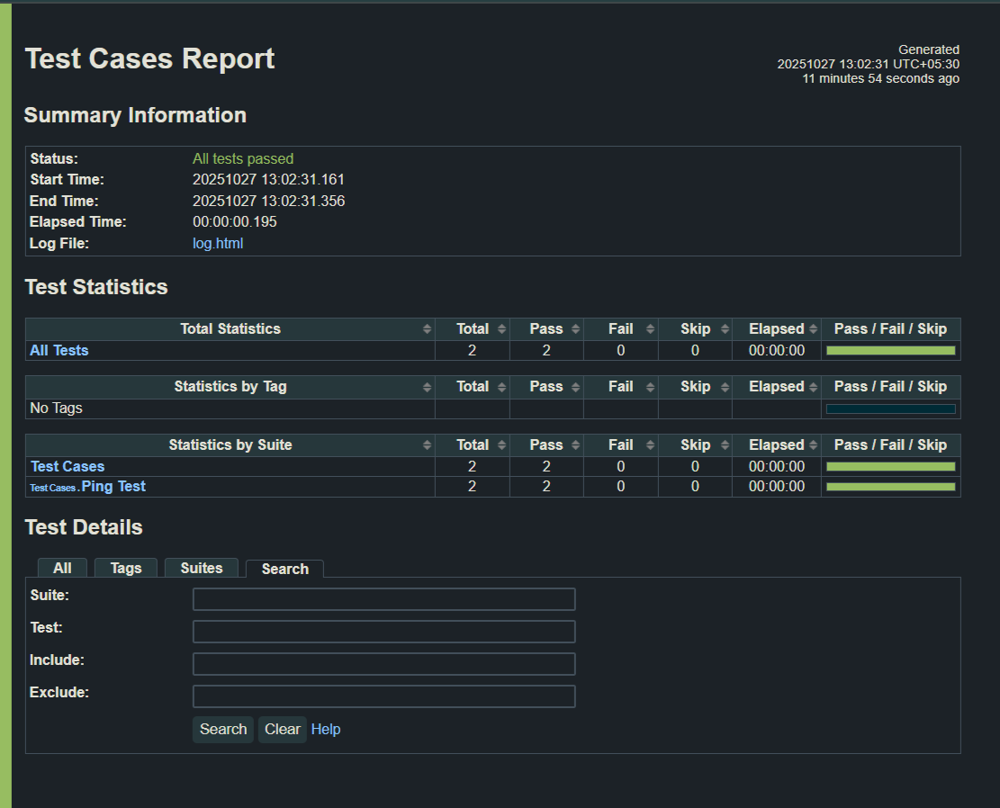

# 🧪 Network Automation Testing Framework

## 📘 Overview
This project automates basic network connectivity and latency tests using **Robot Framework** and **Python**.  
It simulates how network test engineers automate repetitive test cases during telecom testing.

## ⚙️ Tech Stack
- Python  
- Robot Framework  
- Ping3 Library  
- SSHLibrary (for remote access)

## 🚀 Features
- Automated ping & latency tests  
- Robot Framework HTML reports  
- Modular keyword-based design  
- Extendable for LTE/5G testing scripts  

## 🧩 How to Run
```bash
git clone https://github.com/vinayakkatwa18072003/Network-Automation-Testing-Framework.git
cd Network-Automation-Testing-Framework
pip install -r requirements.txt
python run_tests.py

## 🧪 Sample Output

When running `python run_tests.py`, a Robot Framework report is generated in `/results/`.

Example console output:


Example test summary (from report.html):

| Test Name | Status | Latency (ms) |
|------------|--------|--------------|
| Ping Network Host | ✅ PASS | 36.42 |
| Measure Latency | ✅ PASS | 36.42 |

## 📸 Report Preview

